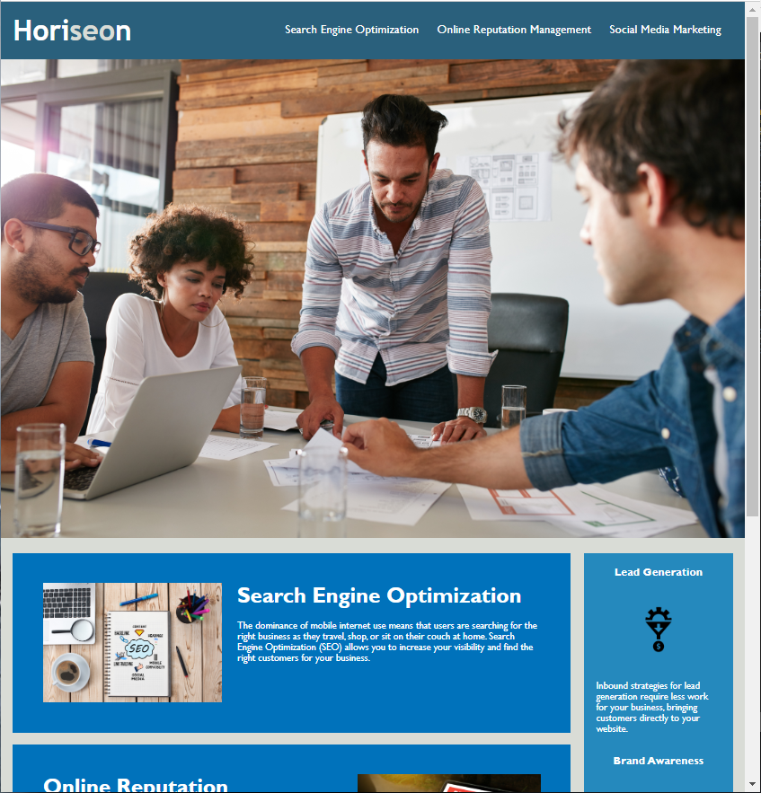

# Berkeley Bootcamp Challenge 1

## Table of Contents

- [Overview](#overview)
  - [The challenge](#challenge)
  - [User Story](#user-story)
  - [Acceptance Criteria](#acceptance-criteria)
  - [Screenshot of Website](#screenshot-of-website)
  - [Project Links](#project-links)
- [Methodology](#methodology)
  - [Built with](#built-with)
  - [What I learned](#what-i-learned)
  - [Continued development](#continued-development)
  - [Useful resources](#useful-resources)
- [Author](#author)

## Overview

### Challenge

A functional website was provided.  The clients have dictated the user story and acceptance criteria to improve on the HTML and CSS files in order to improve SEO and accessibility.  No visual changes were necessary.

### User Story

```

AS A marketing agency
I WANT a codebase that follows accessibility standards
SO THAT our own site is optimized for search engines.
```

###  Acceptance Criteria

```
GIVEN a webpage meets accessibility standards
WHEN I view the source code
THEN I find semantic HTML elements
WHEN I view the structure of the HTML elements
THEN I find that the elements follow a logical structure independent of styling and positioning
WHEN I view the icon and image elements
THEN I find accessible alt attributes
WHEN I view the heading attributes
THEN they fall in sequential order
WHEN I view the title element
THEN I find a concise, descriptive title
```

### Screenshot of Website


### Project Links

- Repository URL: [https://github.com/Unicorn-Barf/homework_1](https://github.com/Unicorn-Barf/homework_1)
- Live Site URL: [https://unicorn-barf.github.io/homework_1/](https://unicorn-barf.github.io/homework_1/)

## Methodology  
  

### Built with

- HTML5
- CSS
- Visual Studio Code
- GitHub

### What I Learned

This was my first project practicing an "on the job" type of challenge.  The difficult part of this challenge was making sure to follow the USER STORY and the ACCEPTANCE CRITERIA strictly.  Also, I had to read through existing code and understand the structure, as well as learn how to refactor it to clean it up visually.

Things I learned:  
- How to use semantic elements in place of div tags
- Importance of comments in code to quickly understand the structure
- How to use selectors effectively in CSS  
- How to use chrome dev tools to run a performance analysis
- What accessability is for web design and how to use "alt" attributes

### Continued Development  
  
In the future, I want to continue to practice refactoring code.  I espcially want to improve at making my CSS files much more clean and structured.  I am interested in developing websites that are more interactive and dynamic to give the user an artistic and immersive experience.  
  
###  Useful Resources

- [Semantic Element Resource](https://www.w3schools.com/html/html5_semantic_elements.asp) - This resource was great as an intro to semantic element tags and is a good quick reference to refresh.  It gives a basic understanding as well as practical knowledge to apply in your projects.

## Author

**Nolan Spence**
- LinkedIn - [https://www.linkedin.com/in/aerospence/](https://www.linkedin.com/in/aerospence/)